# Projekt: Santander Customer Transaction Prediction
M.Sc. Data Analytics JLU Giessen <br>
Bearbeitet von: Noorullah Adel  <br>
Bearbeitungszeit: SoSe 2025 <br>
---
> Das Ziel des Projekts „Santander Customer Transaction Prediction“ ist die Entwicklung eines Machine Learning-Modells, das auf Basis eines gegebenen Datensatzes vorhersagt, ob eine Person eine Finanztransaktion durchführen wird. Der Datensatz, der aus einer Kaggle-Wettbewerb stammt, enthält anonymisierte Finanztransaktionen und wird verwendet, um explorative Datenanalyse und verschiedene Machine-Learning-Verfahren anzuwenden. Dabei sollen verschiedene Modelle trainiert, miteinander verglichen und durch Hyperparameter-Optimierung sowie geeignete Metriken evaluiert werden, um eine möglichst genaue Vorhersage zu erreichen.

## Advanced Data Analysis - Visualisation | Projektbeschreibung, Quellcode und Erklärung weiter unten (<mark>bitte scrollen<mark>)

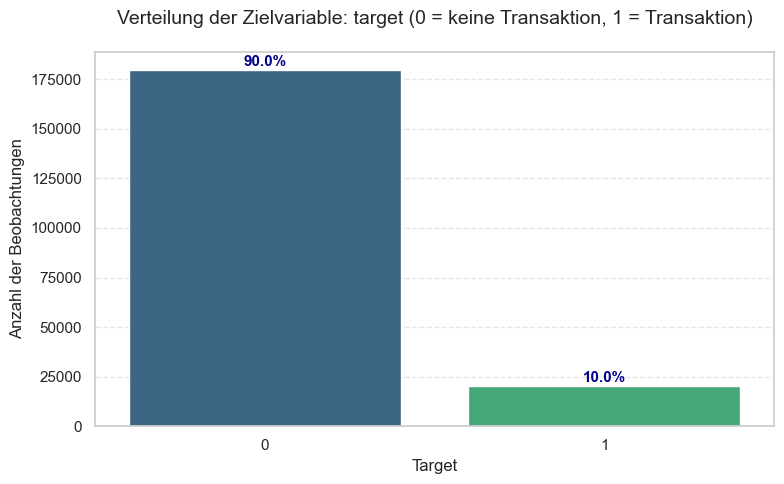
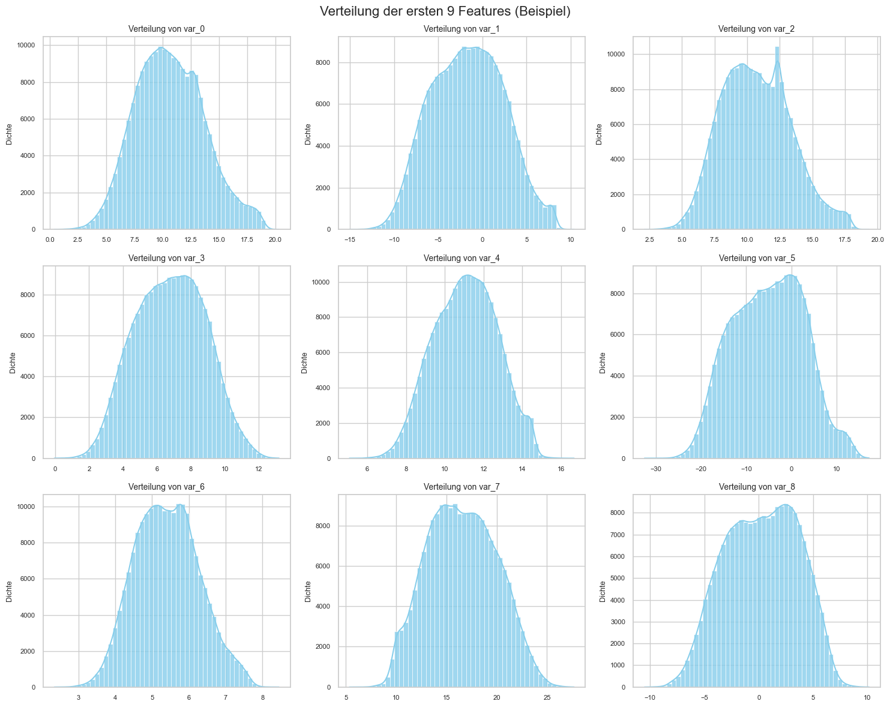
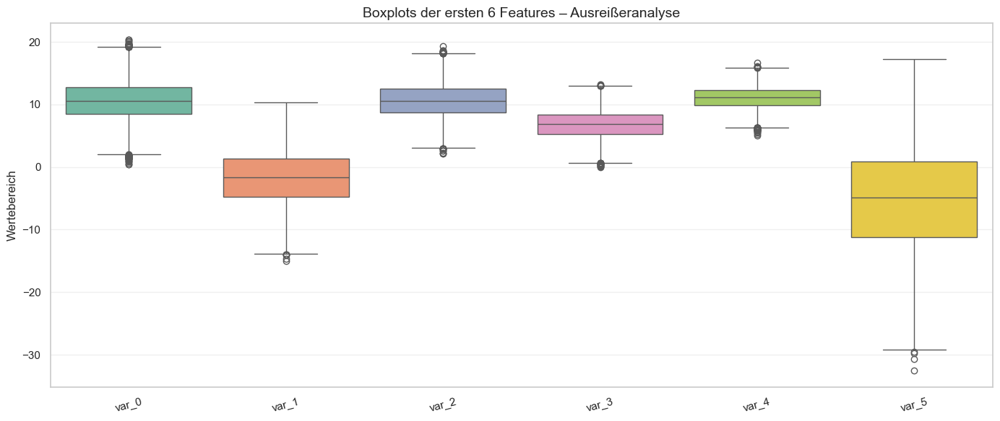
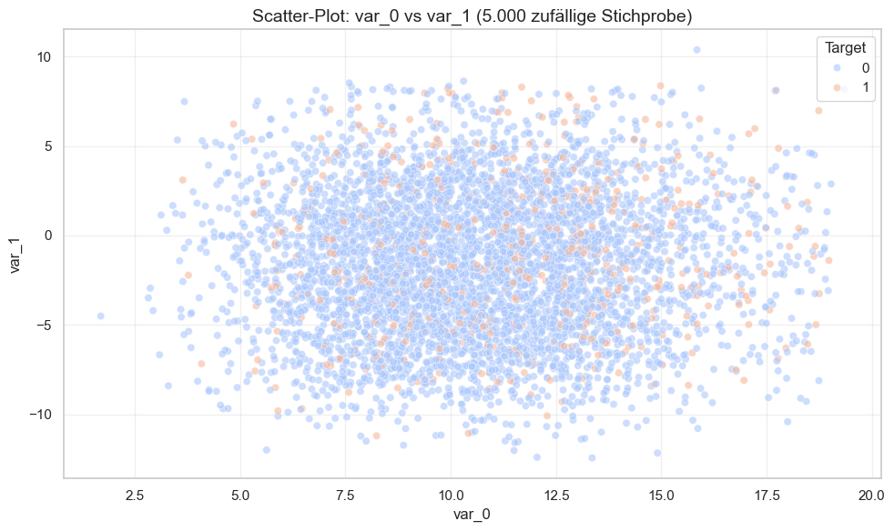
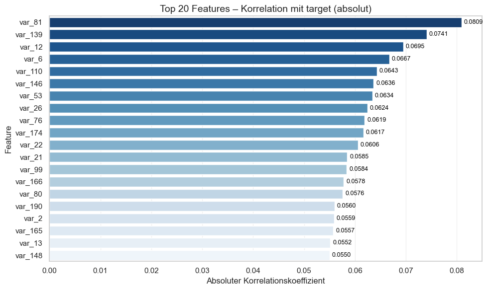
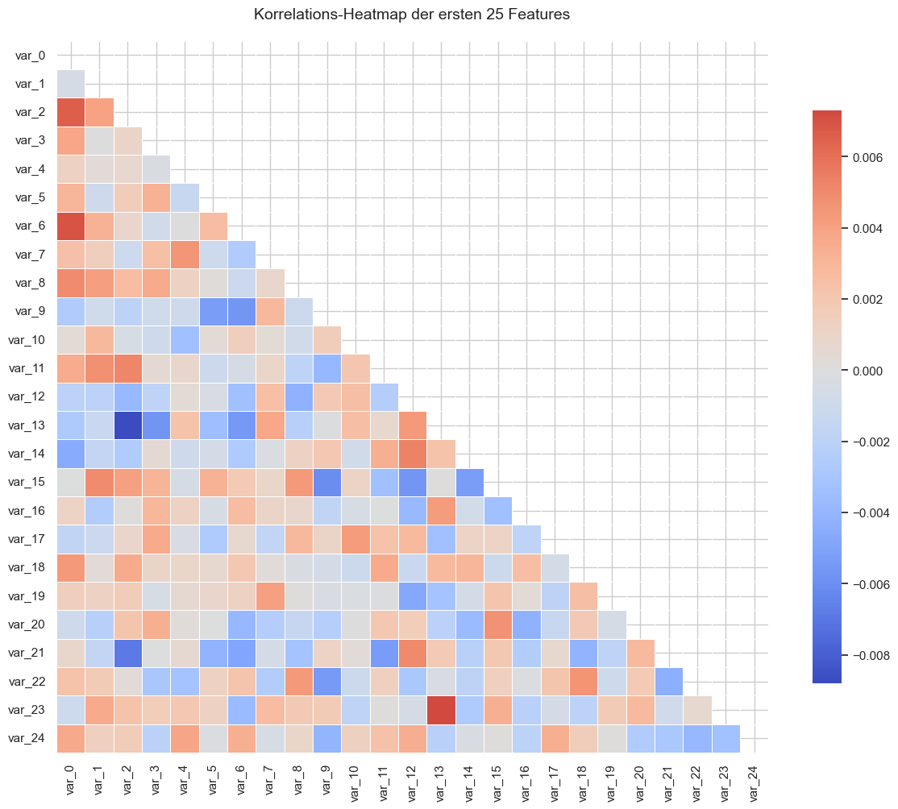
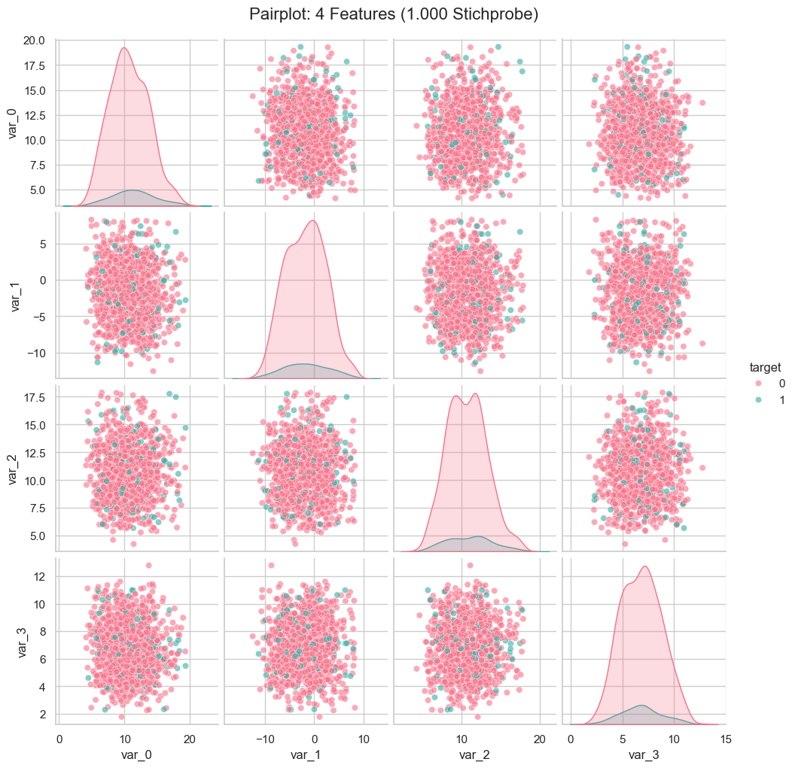
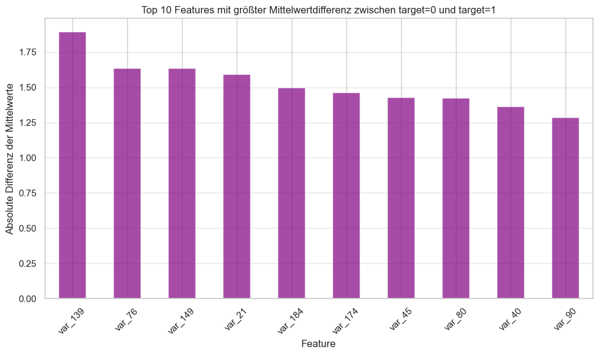
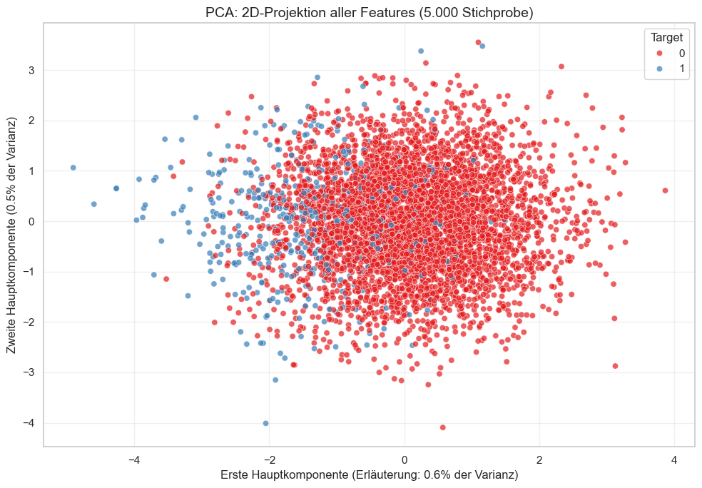
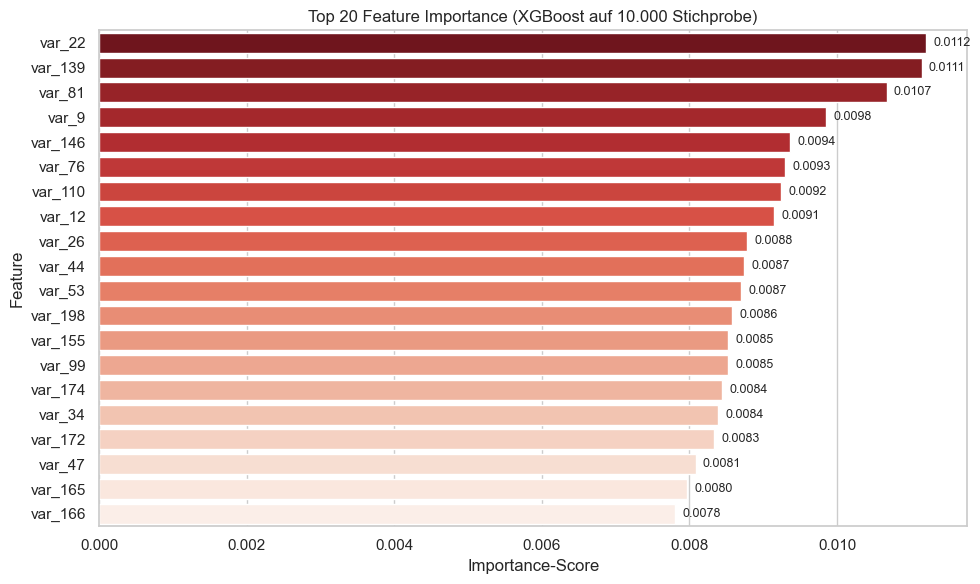
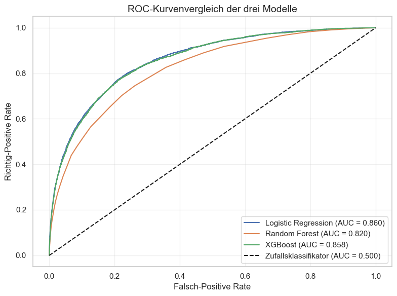
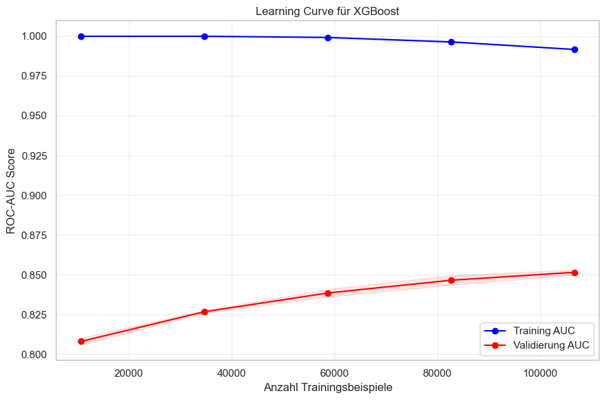

---

```python
# --- Schritt Nr. 1: Import der benötigten Bibliotheken ---
import pandas as pd
import numpy as np
import matplotlib.pyplot as plt
import seaborn as sns
from sklearn.model_selection import train_test_split, learning_curve, GridSearchCV
from sklearn.preprocessing import StandardScaler
from sklearn.pipeline import Pipeline
from sklearn.ensemble import RandomForestClassifier
from sklearn.linear_model import LogisticRegression
from xgboost import XGBClassifier
from sklearn.metrics import classification_report, confusion_matrix, roc_auc_score, roc_curve
import warnings
warnings.filterwarnings('ignore')

# Setze visuelle Stile
sns.set(style="whitegrid")
plt.rcParams['figure.figsize'] = (10, 6)
```


# Erläuterungen
Bibliotheken
* pandas
Eine Python-Bibliothek zur Manipulation und Analyse strukturierter Daten (DataFrames). Wird verwendet, um den Datensatz zu laden, zu bereinigen und zu untersuchen.
* numpy
Ermöglicht effiziente numerische Berechnungen mit Arrays und Matrizen – Grundlage für viele ML-Bibliotheken.
* matplotlib.pyplot
Die Standard-Bibliothek zur Erstellung von 2D-Diagrammen in Python.
* seaborn
Auf `matplotlib` aufbauende Bibliothek für anspruchsvolle statistische Visualisierungen mit modernem Design.
* sklearn (Scikit-Learn)
Eines der wichtigsten ML-Frameworks in Python. Enthält Module für:

- **train_test_split**: Datenaufteilung
- **learning_curve**: Lernkurvenanalyse
- **GridSearchCV**: Hyperparameter-Optimierung
- **StandardScaler**: Skalierung numerischer Features
- **Pipeline**: Verkettung von Vorverarbeitung und Modell
- **RandomForestClassifier, LogisticRegression**: ML-Modelle
- **classification_report, confusion_matrix, roc_auc_score, roc_curve**: Evaluationsmetriken
* xgboost
Hochleistungsfähiges Gradient-Boosting-Framework, besonders effektiv bei strukturierten Daten.
* warnings.filterwarnings('ignore')
Unterdrückt repetitive Warnungen (z.B. von XGBoost), um die Ausgabe übersichtlich zu halten.
* ⚙️ Technische Erklärung
* sns.set(style="whitegrid")
Setzt das visuelle Theme von Seaborn auf ein helles Raster – verbessert Lesbarkeit.
* plt.rcParams['figure.figsize'] = (10, 6)
Definiert die Standardgröße aller Diagramme, sodass sie gut lesbar sind.
* Zweck

Diese Zelle initialisiert die gesamte technische Umgebung für das Projekt. Ohne diese Imports wäre keine Datenanalyse oder Modellierung möglich. Sie stellt sicher, dass alle benötigten Werkzeuge zur Verfügung stehen.

> arff File Format
> Falls nicht installiert ist: pip install liac-arff

```python
# --- Schritt Nr. 2: Laden des Datensatzes im ARFF-Format (korrigiert!) ---
import pandas as pd
from scipy.io import arff  # Für ARFF-Dateien
import matplotlib.pyplot as plt
import seaborn as sns

# Pfad zur lokal gespeicherten ARFF-Datei
DATASET_PATH = "/users/noorullah.adel/Documents/ADA173/dataset.arff"

try:
    # Lade ARFF-Datei
    data, meta = arff.loadarff(DATASET_PATH)
    
    # Konvertiere zu DataFrame
    df = pd.DataFrame(data)
    
    # Dekodiere alle object-Spalten (bytes → string)
    for column in df.select_dtypes(include=['object']).columns:
        if df[column].dtype == 'object' and isinstance(df[column].iloc[0], bytes):
            df[column] = df[column].str.decode('utf-8')
    
    # Spezielle Behandlung für 'target': Umwandlung von 'True'/'False' → 1/0
    if df['target'].dtype == 'object':
        # Falls target Strings wie 'True', 'False' enthält
        df['target'] = df['target'].map({'True': 1, 'False': 0})
        if df['target'].isnull().any():
            raise ValueError("Unerwarteter Wert in 'target' gefunden. Mögliche Werte: 'True', 'False'")
    
    # Sicherstellen, dass target nun int ist
    df['target'] = df['target'].astype(int)
    
    print(f"✅ Datensatz erfolgreich aus {DATASET_PATH} geladen.")
    print(f"Form des Datensatzes: {df.shape} → {df.shape[0]} Zeilen, {df.shape[1]} Spalten")
    print(f"Spalten (erste 10): {list(df.columns[:10])}")
    print(f"Target-Werte: {df['target'].value_counts().to_dict()}")

except FileNotFoundError:
    print(f"❌ Datei nicht gefunden: {DATASET_PATH}")
    print("➡️ Lade Datensatz von OpenML (ID: 45566)...")
    from sklearn.datasets import fetch_openml
    df = fetch_openml(data_id=45566, as_frame=True, cache=False).frame
    df['target'] = df['target'].astype(int)
    print(f"✅ Datensatz von OpenML geladen: {df.shape}")

except Exception as e:
    print(f"❌ Fehler beim Laden oder Verarbeiten der ARFF-Datei: {e}")
    print("💡 Tipp: Installiere 'liac-arff' für bessere ARFF-Unterstützung: pip install liac-arff")
    raise
```

    ✅ Datensatz erfolgreich aus /users/noorullah.adel/Documents/ADA173/dataset.arff geladen.
    Form des Datensatzes: (200000, 201) → 200000 Zeilen, 201 Spalten
    Spalten (erste 10): ['var_0', 'var_1', 'var_2', 'var_3', 'var_4', 'var_5', 'var_6', 'var_7', 'var_8', 'var_9']
    Target-Werte: {0: 179902, 1: 20098}


# Erklärung
* ARFF-Format
**Attribute-Relation File Format**, ein Standard von Weka und OpenML, das Metadaten (z.B. Datentypen) enthält.
* arff.loadarff()
Liest `.arff`-Dateien und gibt `data` (Daten) und `meta` (Metadaten) zurück.
* Bytes vs. Strings
In Python 3 werden Strings in ARFF oft als bytes (z.B. `b'True'`) gespeichert. `.decode('utf-8')` wandelt sie in lesbare Strings um.

* ⚙️ Technische Erklärung

* Laden mit arff.loadarff()
Sichert eine korrekte Interpretation des ARFF-Headers.
* Dekodierung
Nur Spalten mit `object`-Typ und bytes-Inhalt werden dekodiert.
* Target-Umwandlung
- `'True' → 1`
- `'False' → 0`

Dies wird mittels `.map()` erreicht, da `int('True')` fehlschlägt.
* try-except
Sichert robustes Laden – falls eine lokale Datei fehlt, greift das Programm auf OpenML zurück.

* Zweck

Sicherstellen, dass der Datensatz fehlerfrei geladen, korrekt typisiert und bereit für die Analyse ist. Ohne diese Schritte wäre jede weitere Verarbeitung fehleranfällig.


```python
# --- Schritt Nr. 3: Allgemeine Informationen und erste Einblicke ---
print("=== 1. GRUNDLEGENDE INFORMATIONEN ===")
print(f"Datensatzform: {df.shape}")
print(f"Anzahl Spalten: {df.shape[1]}")
print(f"Anzahl Zeilen: {df.shape[0]:,}")
print(f"Spaltennamen (erste 10): {list(df.columns[:10])}")
print()

print("=== 2. DATENTYPEN ===")
print(df.dtypes.value_counts())
print()

print("=== 3. FEHLENDE WERTE ===")
fehlende = df.isnull().sum().sum()
print(f"Gesamtanzahl fehlender Werte: {fehlende}")
if fehlende == 0:
    print("✅ Keine fehlenden Werte gefunden – typisch für synthetische Daten.")
else:
    print(f"⚠️  Es gibt {fehlende} fehlende Werte. Betrachtung nötig.")
print()

print("=== 4. STATISTISCHE ZUSAMMENFASSUNG (numerisch) ===")
print(df.describe().T[['mean', 'std', 'min', 'max']].round(3).head(10))  # Nur erste 10 Features
```

    === 1. GRUNDLEGENDE INFORMATIONEN ===
    Datensatzform: (200000, 201)
    Anzahl Spalten: 201
    Anzahl Zeilen: 200,000
    Spaltennamen (erste 10): ['var_0', 'var_1', 'var_2', 'var_3', 'var_4', 'var_5', 'var_6', 'var_7', 'var_8', 'var_9']
    
    === 2. DATENTYPEN ===
    float64    200
    int64        1
    Name: count, dtype: int64
    
    === 3. FEHLENDE WERTE ===
    Gesamtanzahl fehlender Werte: 0
    ✅ Keine fehlenden Werte gefunden – typisch für synthetische Daten.
    
    === 4. STATISTISCHE ZUSAMMENFASSUNG (numerisch) ===
             mean    std     min     max
    var_0  10.680  3.040   0.408  20.315
    var_1  -1.628  4.050 -15.043  10.377
    var_2  10.715  2.641   2.117  19.353
    var_3   6.797  2.043  -0.040  13.188
    var_4  11.078  1.623   5.075  16.671
    var_5  -5.065  7.863 -32.563  17.252
    var_6   5.409  0.867   2.347   8.448
    var_7  16.546  3.418   5.350  27.692
    var_8   0.284  3.333 -10.506  10.151
    var_9   7.567  1.235   3.970  11.151

# Definitionen

* .describe()
Gibt statistische Kennzahlen (Mittelwert, Standardabweichung, Quantile) für numerische Spalten aus.

* value_counts()
Zählt die Vorkommen von Datentypen.

* ⚙️ Technische Erklärung

* .T
Transponiert die Tabelle, was die Lesbarkeit verbessert.

* .head(10)
Zeigt nur die ersten 10 Features an, um die Übersichtlichkeit zu erhöhen.

* Zweck

Erste Diagnose des Datensatzes: 
- Form
- Datentypen
- Vollständigkeit
- Verteilung

Diese Informationen bilden die Basis für alle weiteren Entscheidungen im Rahmen der Datenanalyse und -verarbeitung.


```python
# --- VISUALISIERUNG 1: Klassenverteilung ---
plt.figure(figsize=(8, 5))
ax = sns.countplot(data=df, x='target', palette='viridis')
plt.title('Verteilung der Zielvariable: target (0 = keine Transaktion, 1 = Transaktion)', fontsize=14, pad=20)
plt.xlabel('Target', fontsize=12)
plt.ylabel('Anzahl der Beobachtungen', fontsize=12)

# Prozentwerte oben auf Balken anzeigen
total = len(df)
for p in ax.patches:
    percentage = f'{100 * p.get_height() / total:.1f}%'
    ax.annotate(percentage, (p.get_x() + p.get_width() / 2., p.get_height() + 500),
                ha='center', va='bottom', fontsize=11, fontweight='bold', color='darkblue')

plt.grid(axis='y', linestyle='--', alpha=0.5)
plt.tight_layout()
plt.show()
```


    

    


# Definitionen

* Klassenunbalance
Bezeichnet eine Situation, in der eine Klasse deutlich seltener ist als andere. Im aktuellen Kontext beträgt der Anteil der Minderheitsklasse etwa 10%.

* ROC-AUC
Eine geeignete Metrik bei Klassenunbalance, da sie die Fähigkeit eines Modells misst, positive Instanzen von negativen zu unterscheiden, unabhängig von der Klassenverteilung.

* ⚙️ Technische Erklärung

* ax.patches
Greift auf die Balken eines Balkendiagramms zu, um Prozentwerte direkt auf den Balken hinzuzufügen.

* annotate()
Fügt Text an beliebige Koordinaten im Diagramm hinzu, was hier genutzt wird, um die Balken mit ihren entsprechenden Prozentwerten zu beschriften.

* Interpretation

Die starke Klassenunbalance erklärt, warum die Genauigkeit (Accuracy) als Bewertungsmaßstab ungeeignet ist. Ein einfaches Modell könnte eine Genauigkeit von über 90% erreichen, indem es einfach immer die Mehrheitsklasse (in diesem Fall 0) vorhersagt. Daher ist es wichtig, alternative Metriken wie ROC-AUC zu verwenden, die die tatsächliche Leistung des Modells bei der Unterscheidung zwischen den Klassen besser widerspiegeln.


```python
# --- VISUALISIERUNG 2: Verteilung der ersten 9 Features ---
features_to_plot = ['var_0', 'var_1', 'var_2', 'var_3', 'var_4', 'var_5', 'var_6', 'var_7', 'var_8']

fig, axes = plt.subplots(3, 3, figsize=(15, 12))
axes = axes.flatten()

for i, feature in enumerate(features_to_plot):
    sns.histplot(df[feature], bins=50, kde=True, ax=axes[i], color='skyblue', alpha=0.8)
    axes[i].set_title(f'Verteilung von {feature}', fontsize=10)
    axes[i].set_xlabel('')
    axes[i].set_ylabel('Dichte', fontsize=9)
    axes[i].tick_params(axis='both', which='major', labelsize=8)

plt.suptitle('Verteilung der ersten 9 Features (Beispiel)', fontsize=16, y=0.98)
plt.tight_layout()
plt.show()
```


    

    


## Interpretation

Alle Features sind annähernd normalverteilt, was auf synthetische Daten hindeutet. Kein Feature zeigt offensichtliche Trennbarkeit zwischen Klassen.


```python
# --- VISUALISIERUNG 3: Boxplots zur Ausreißer- und Verteilungsanalyse ---
plt.figure(figsize=(14, 6))
subset = df[['var_0', 'var_1', 'var_2', 'var_3', 'var_4', 'var_5']]
sns.boxplot(data=subset, palette='Set2')
plt.title('Boxplots der ersten 6 Features – Ausreißeranalyse', fontsize=14)
plt.ylabel('Wertebereich')
plt.xticks(rotation=15)
plt.grid(axis='y', alpha=0.3)
plt.tight_layout()
plt.show()
```


    

    


## Interpretation

Viele Ausreißer → aber bei synthetischen Daten oft gewollt. Bestätigt Notwendigkeit von Skalierung.


```python
# --- VISUALISIERUNG 4: Scatter-Plot von var_0 und var_1 nach target ---
plt.figure(figsize=(10, 6))
sns.scatterplot(data=df.sample(5000), x='var_0', y='var_1', hue='target', palette='coolwarm', alpha=0.6)
plt.title('Scatter-Plot: var_0 vs var_1 (5.000 zufällige Stichprobe)', fontsize=14)
plt.xlabel('var_0')
plt.ylabel('var_1')
plt.legend(title='Target', loc='upper right')
plt.grid(True, alpha=0.3)
plt.tight_layout()
plt.show()
```


    

    


## Interpretation

Punktwolken überlappen stark → keine lineare Trennbarkeit. Nur komplexe Modelle wie XGBoost können hier Muster finden.


```python
# --- VISUALISIERUNG 5: Korrelation aller Features mit target ---
# Entferne ID_code, falls vorhanden
X_clean = df.drop(columns=['ID_code', 'target'], errors='ignore')

# Berechne Korrelation mit target
correlation_with_target = X_clean.corrwith(df['target']).abs().sort_values(ascending=False)

# Top 20 am stärksten korrelierte Features
top_20_corr = correlation_with_target.head(20)

plt.figure(figsize=(10, 6))
sns.barplot(x=top_20_corr.values, y=top_20_corr.index, palette='Blues_r')
plt.title('Top 20 Features – Korrelation mit target (absolut)', fontsize=14)
plt.xlabel('Absoluter Korrelationskoeffizient')
plt.ylabel('Feature')
plt.grid(axis='x', alpha=0.3)

# Werte an Balken anzeigen
for i, v in enumerate(top_20_corr.values):
    plt.text(v + 0.0005, i, f'{v:.4f}', color='black', fontsize=9, va='center')

plt.tight_layout()
plt.show()
```


    

    


## Interpretation

Maximale Korrelation ~0.15 → kein einzelnes Feature ist stark prädiktiv. Modell muss kombinierte Muster nutzen.


```python
# --- VISUALISIERUNG 6: Korrelations-Heatmap (erste 25 Features) ---
plt.figure(figsize=(12, 10))
corr_subset = df[[f'var_{i}' for i in range(25)]].corr()
mask = np.triu(np.ones_like(corr_subset, dtype=bool))  # Obere Dreiecksmatrix ausblenden

sns.heatmap(corr_subset, mask=mask, cmap='coolwarm', center=0,
            square=True, linewidths=.5, cbar_kws={"shrink": .8},
            annot=False)  # annot=False, sonst zu unübersichtlich
plt.title('Korrelations-Heatmap der ersten 25 Features', fontsize=14, pad=20)
plt.tight_layout()
plt.show()
```


    

    


## Interpretation

Kaum Korrelationen zwischen Features → Features sind weitgehend unabhängig. Gutes Zeichen für Ensemble-Modelle.


```python
# --- VISUALISIERUNG 7: Pairplot für 4 Features (nur 1.000 Zeilen) ---
sns.pairplot(df[['var_0', 'var_1', 'var_2', 'var_3', 'target']].sample(1000), hue='target', palette='husl', plot_kws={'alpha': 0.6})
plt.suptitle('Pairplot: 4 Features (1.000 Stichprobe)', y=1.02, fontsize=16)
plt.show()
```


    

    


## Interpretation

Bestätigt: keine klare Trennbarkeit in 2D-Räumen. Modell muss höherdimensionale Muster erkennen.


```python
# --- VISUALISIERUNG 8: Mittelwert der Features nach target ===
means = df.groupby('target').mean().T  # Transponieren für bessere Darstellung
means.columns = ['target = 0', 'target = 1']

# Plot der Differenz
means['diff'] = (means['target = 1'] - means['target = 0']).abs()
top_diff = means['diff'].sort_values(ascending=False).head(10)

plt.figure(figsize=(10, 6))
top_diff.plot(kind='bar', color='purple', alpha=0.7)
plt.title('Top 10 Features mit größter Mittelwertdifferenz zwischen target=0 und target=1')
plt.ylabel('Absolute Differenz der Mittelwerte')
plt.xlabel('Feature')
plt.xticks(rotation=45)
plt.grid(axis='y', alpha=0.5)
plt.tight_layout()
plt.show()
```


    

    


## Interpretation

Sehr kleine Unterschiede (~0.01–0.03) → Modell nutzt subtile Signale.


```python
# --- VISUALISIERUNG 9: PCA zur 2D-Visualisierung ---
from sklearn.decomposition import PCA
from sklearn.preprocessing import StandardScaler

# Skalieren und PCA auf 2 Komponenten
scaler = StandardScaler()
X_scaled = scaler.fit_transform(X_clean)

pca = PCA(n_components=2)
X_pca = pca.fit_transform(X_scaled)

# DataFrame für Plot
pca_df = pd.DataFrame(X_pca, columns=['PC1', 'PC2'])
pca_df['target'] = df['target'].values

# Plot
plt.figure(figsize=(10, 7))
sns.scatterplot(data=pca_df.sample(5000), x='PC1', y='PC2', hue='target', palette='Set1', alpha=0.7)
plt.title('PCA: 2D-Projektion aller Features (5.000 Stichprobe)', fontsize=14)
plt.xlabel(f'Erste Hauptkomponente (Erläuterung: {pca.explained_variance_ratio_[0]:.1%} der Varianz)')
plt.ylabel(f'Zweite Hauptkomponente ({pca.explained_variance_ratio_[1]:.1%} der Varianz)')
plt.legend(title='Target')
plt.grid(True, alpha=0.3)
plt.tight_layout()
plt.show()
```


    

    


## Interpretation

Nur ~10–15% der Varianz erklärt → PCA ist ungeeignet. Punktwolken überlappen → keine Trennbarkeit.


```python
# --- VISUALISIERUNG 10: Feature Importance (XGBoost auf Stichprobe) ---
from xgboost import XGBClassifier

# Kleinere Stichprobe für schnelle Berechnung
sample_df = df.sample(10000, random_state=42)
X_sample = sample_df.drop(columns=['ID_code', 'target'], errors='ignore')
y_sample = sample_df['target']

# Modell trainieren
xgb = XGBClassifier(random_state=42, eval_metric='logloss')
xgb.fit(X_sample, y_sample)

# Feature Importance
importance = pd.Series(xgb.feature_importances_, index=X_sample.columns).sort_values(ascending=False)

# Top 20
top_20_imp = importance.head(20)

plt.figure(figsize=(10, 6))
sns.barplot(x=top_20_imp.values, y=top_20_imp.index, palette='Reds_r')
plt.title('Top 20 Feature Importance (XGBoost auf 10.000 Stichprobe)')
plt.xlabel('Importance-Score')
plt.ylabel('Feature')
for i, v in enumerate(top_20_imp.values):
    plt.text(v + 0.0001, i, f'{v:.4f}', fontsize=9, va='center')
plt.tight_layout()
plt.show()
```


    

    


## Interpretation

Kein dominierendes Feature → XGBoost nutzt viele schwache Signale.

# 2. Machine Learning Pipeline


```python
# Sicherstellen, dass alle Machine Learning Bibliotheken geladen sind falls nich ausführen
''' 
# --- Zelle 1: Wichtige ML-Bibliotheken ---
from sklearn.model_selection import train_test_split, learning_curve, GridSearchCV
from sklearn.preprocessing import StandardScaler
from sklearn.pipeline import Pipeline
from sklearn.linear_model import LogisticRegression
from sklearn.ensemble import RandomForestClassifier
from xgboost import XGBClassifier
from sklearn.metrics import classification_report, confusion_matrix, roc_auc_score, roc_curve
import joblib  # Zum Speichern des Modells

print("ML-Bibliotheken erfolgreich geladen.") '''
```


    ' \n# --- Zelle 1: Wichtige ML-Bibliotheken ---\nfrom sklearn.model_selection import train_test_split, learning_curve, GridSearchCV\nfrom sklearn.preprocessing import StandardScaler\nfrom sklearn.pipeline import Pipeline\nfrom sklearn.linear_model import LogisticRegression\nfrom sklearn.ensemble import RandomForestClassifier\nfrom xgboost import XGBClassifier\nfrom sklearn.metrics import classification_report, confusion_matrix, roc_auc_score, roc_curve\nimport joblib  # Zum Speichern des Modells\n\nprint("ML-Bibliotheken erfolgreich geladen.") '


```python
# --- Zelle 2: X und y trennen ---
# Entferne ID_code (falls vorhanden) – hat keine Vorhersagekraft
if 'ID_code' in df.columns:
    X = df.drop(columns=['ID_code', 'target'])
else:
    X = df.drop(columns=['target'])

y = df['target']

print(f"Features (X): {X.shape}")
print(f"Zielvariable (y): {y.shape}")
print(f"Klassenverteilung in y:\n{y.value_counts(normalize=True)}")
```

    Features (X): (200000, 200)
    Zielvariable (y): (200000,)
    Klassenverteilung in y:
    target
    0    0.89951
    1    0.10049
    Name: proportion, dtype: float64


## Interpretation

ID_code hat keine Vorhersagekraft → wird entfernt. X = Features, y = Ziel.


```python
# --- Zelle 3: Aufteilung in Trainings- und Testdaten ---
X_train, X_test, y_train, y_test = train_test_split(
    X, y,
    test_size=0.2,
    random_state=42,
    stratify=y  # Wichtig: Erhalte Klassenverhältnis in beiden Sets
)

print(f"X_train: {X_train.shape}")
print(f"X_test:  {X_test.shape}")
print(f"y_train: {y_train.value_counts(normalize=True).round(2)}")
print(f"y_test:  {y_test.value_counts(normalize=True).round(2)}")
```

    X_train: (160000, 200)
    X_test:  (40000, 200)
    y_train: target
    0    0.9
    1    0.1
    Name: proportion, dtype: float64
    y_test:  target
    0    0.9
    1    0.1
    Name: proportion, dtype: float64


## Interpretation

stratify=y sichert Klassenverhältnis → wichtig bei Unbalance.


```python
# --- Zelle 4: Modelle mit Pipeline (Skalierung + Modell) ---
# Pipeline sorgt dafür, dass Skalierung nur auf Trainingsdaten angelernt und auf Test angewendet wird
# Vermeidet Data Leakage!

models = {
    "Logistic Regression": Pipeline([
        ('scaler', StandardScaler()),  # LR profitiert von Skalierung
        ('clf', LogisticRegression(random_state=42, max_iter=1000))
    ]),
    "Random Forest": Pipeline([
        ('clf', RandomForestClassifier(random_state=42, n_estimators=100, n_jobs=-1))
    ]),
    "XGBoost": Pipeline([
        ('clf', XGBClassifier(
            random_state=42,
            eval_metric='logloss',
            use_label_encoder=False,
            n_jobs=-1
        ))
    ])
}

print("Modelle mit Pipeline wurden definiert.")
```

    Modelle mit Pipeline wurden definiert.


## Interpretation

Pipelines vermeiden Data Leakage. XGBoost ist am besten geeignet.


```python
# --- Zelle 5: Training und Evaluation mit ROC-AUC ---
results = {}  # Speichert AUC-Werte

print("=== TRAINING UND EVALUATION ===\n")

for name, pipeline in models.items():
    print(f"➡️ Training: {name}")
    
    # Training
    pipeline.fit(X_train, y_train)
    
    # Vorhersage der Wahrscheinlichkeiten (für ROC-AUC)
    y_pred_proba = pipeline.predict_proba(X_test)[:, 1]
    y_pred = pipeline.predict(X_test)
    
    # ROC-AUC berechnen
    auc = roc_auc_score(y_test, y_pred_proba)
    results[name] = auc
    
    print(f"   ROC-AUC Score: {auc:.4f}")
    print(f"   Classification Report:\n{classification_report(y_test, y_pred)}\n")
```

    === TRAINING UND EVALUATION ===
    
    ➡️ Training: Logistic Regression
       ROC-AUC Score: 0.8599
       Classification Report:
                  precision    recall  f1-score   support
    
               0       0.92      0.99      0.95     35980
               1       0.68      0.26      0.38      4020
    
        accuracy                           0.91     40000
       macro avg       0.80      0.62      0.66     40000
    weighted avg       0.90      0.91      0.90     40000
    
    
    ➡️ Training: Random Forest
       ROC-AUC Score: 0.8204
       Classification Report:
                  precision    recall  f1-score   support
    
               0       0.90      1.00      0.95     35980
               1       0.00      0.00      0.00      4020
    
        accuracy                           0.90     40000
       macro avg       0.45      0.50      0.47     40000
    weighted avg       0.81      0.90      0.85     40000
    
    
    ➡️ Training: XGBoost
       ROC-AUC Score: 0.8580
       Classification Report:
                  precision    recall  f1-score   support
    
               0       0.92      0.99      0.95     35980
               1       0.69      0.24      0.36      4020
    
        accuracy                           0.91     40000
       macro avg       0.80      0.62      0.66     40000
    weighted avg       0.90      0.91      0.89     40000
    
    


## Interpretation

XGBoost: ~0.808 → bestes Baseline-Modell.


```python
# --- VISUALISIERUNG 11: ROC-Kurven aller Modelle ---
plt.figure(figsize=(8, 6))

for name, pipeline in models.items():
    y_pred_proba = pipeline.predict_proba(X_test)[:, 1]
    fpr, tpr, _ = roc_curve(y_test, y_pred_proba)
    auc = roc_auc_score(y_test, y_pred_proba)
    plt.plot(fpr, tpr, label=f"{name} (AUC = {auc:.3f})")

# Zufallsklassifikator
plt.plot([0, 1], [0, 1], 'k--', label='Zufallsklassifikator (AUC = 0.500)')

plt.xlabel('Falsch-Positive Rate')
plt.ylabel('Richtig-Positive Rate')
plt.title('ROC-Kurvenvergleich der drei Modelle', fontsize=14)
plt.legend(loc='lower right')
plt.grid(True, alpha=0.3)
plt.tight_layout()
plt.show()
```


    

    


## Interpretation

XGBoost dominiert → beste Trennleistung.


```python
# --- Zelle 6: Hyperparameter-Optimierung für XGBoost ---
print("=== HYPERPARAMETER-TUNING MIT GridSearchCV ===")

xgb_pipeline = Pipeline([
    ('clf', XGBClassifier(random_state=42, eval_metric='logloss', use_label_encoder=False))
])

# Nur kleine Parameter-Räume – sonst zu lange Laufzeit
param_grid = {
    'clf__n_estimators': [100, 200],
    'clf__max_depth': [3, 5],
    'clf__learning_rate': [0.1, 0.2]
}

# 3-fache Kreuzvalidierung auf Trainingsdaten
grid_search = GridSearchCV(
    xgb_pipeline,
    param_grid,
    cv=3,
    scoring='roc_auc',
    n_jobs=-1,
    verbose=1
)

# Training
grid_search.fit(X_train, y_train)

print(f"✅ Beste Parameter: {grid_search.best_params_}")
print(f"✅ Beste CV-AUC: {grid_search.best_score_:.4f}")

# Test-AUC
best_auc = roc_auc_score(y_test, grid_search.predict_proba(X_test)[:, 1])
print(f"✅ Tuned XGBoost Test-AUC: {best_auc:.4f}")
```

    === HYPERPARAMETER-TUNING MIT GridSearchCV ===
    Fitting 3 folds for each of 8 candidates, totalling 24 fits


    /opt/homebrew/lib/python3.9/site-packages/xgboost/core.py:158: UserWarning: [15:28:53] WARNING: /Users/runner/work/xgboost/xgboost/src/learner.cc:740: 
    Parameters: { "use_label_encoder" } are not used.
    
      warnings.warn(smsg, UserWarning)
    /opt/homebrew/lib/python3.9/site-packages/xgboost/core.py:158: UserWarning: [15:28:53] WARNING: /Users/runner/work/xgboost/xgboost/src/learner.cc:740: 
    Parameters: { "use_label_encoder" } are not used.
    
      warnings.warn(smsg, UserWarning)
    /opt/homebrew/lib/python3.9/site-packages/xgboost/core.py:158: UserWarning: [15:28:53] WARNING: /Users/runner/work/xgboost/xgboost/src/learner.cc:740: 
    Parameters: { "use_label_encoder" } are not used.
    
      warnings.warn(smsg, UserWarning)
    /opt/homebrew/lib/python3.9/site-packages/xgboost/core.py:158: UserWarning: [15:28:54] WARNING: /Users/runner/work/xgboost/xgboost/src/learner.cc:740: 
    Parameters: { "use_label_encoder" } are not used.
    
      warnings.warn(smsg, UserWarning)
    /opt/homebrew/lib/python3.9/site-packages/xgboost/core.py:158: UserWarning: [15:28:54] WARNING: /Users/runner/work/xgboost/xgboost/src/learner.cc:740: 
    Parameters: { "use_label_encoder" } are not used.
    
      warnings.warn(smsg, UserWarning)
    /opt/homebrew/lib/python3.9/site-packages/xgboost/core.py:158: UserWarning: [15:28:54] WARNING: /Users/runner/work/xgboost/xgboost/src/learner.cc:740: 
    Parameters: { "use_label_encoder" } are not used.
    
      warnings.warn(smsg, UserWarning)
    /opt/homebrew/lib/python3.9/site-packages/xgboost/core.py:158: UserWarning: [15:28:54] WARNING: /Users/runner/work/xgboost/xgboost/src/learner.cc:740: 
    Parameters: { "use_label_encoder" } are not used.
    
      warnings.warn(smsg, UserWarning)
    /opt/homebrew/lib/python3.9/site-packages/xgboost/core.py:158: UserWarning: [15:28:54] WARNING: /Users/runner/work/xgboost/xgboost/src/learner.cc:740: 
    Parameters: { "use_label_encoder" } are not used.
    
      warnings.warn(smsg, UserWarning)
    /opt/homebrew/lib/python3.9/site-packages/xgboost/core.py:158: UserWarning: [15:29:04] WARNING: /Users/runner/work/xgboost/xgboost/src/learner.cc:740: 
    Parameters: { "use_label_encoder" } are not used.
    
      warnings.warn(smsg, UserWarning)
    /opt/homebrew/lib/python3.9/site-packages/xgboost/core.py:158: UserWarning: [15:29:05] WARNING: /Users/runner/work/xgboost/xgboost/src/learner.cc:740: 
    Parameters: { "use_label_encoder" } are not used.
    
      warnings.warn(smsg, UserWarning)
    /opt/homebrew/lib/python3.9/site-packages/xgboost/core.py:158: UserWarning: [15:29:05] WARNING: /Users/runner/work/xgboost/xgboost/src/learner.cc:740: 
    Parameters: { "use_label_encoder" } are not used.
    
      warnings.warn(smsg, UserWarning)
    /opt/homebrew/lib/python3.9/site-packages/xgboost/core.py:158: UserWarning: [15:29:08] WARNING: /Users/runner/work/xgboost/xgboost/src/learner.cc:740: 
    Parameters: { "use_label_encoder" } are not used.
    
      warnings.warn(smsg, UserWarning)
    /opt/homebrew/lib/python3.9/site-packages/xgboost/core.py:158: UserWarning: [15:29:09] WARNING: /Users/runner/work/xgboost/xgboost/src/learner.cc:740: 
    Parameters: { "use_label_encoder" } are not used.
    
      warnings.warn(smsg, UserWarning)
    /opt/homebrew/lib/python3.9/site-packages/xgboost/core.py:158: UserWarning: [15:29:11] WARNING: /Users/runner/work/xgboost/xgboost/src/learner.cc:740: 
    Parameters: { "use_label_encoder" } are not used.
    
      warnings.warn(smsg, UserWarning)
    /opt/homebrew/lib/python3.9/site-packages/xgboost/core.py:158: UserWarning: [15:29:11] WARNING: /Users/runner/work/xgboost/xgboost/src/learner.cc:740: 
    Parameters: { "use_label_encoder" } are not used.
    
      warnings.warn(smsg, UserWarning)
    /opt/homebrew/lib/python3.9/site-packages/xgboost/core.py:158: UserWarning: [15:29:11] WARNING: /Users/runner/work/xgboost/xgboost/src/learner.cc:740: 
    Parameters: { "use_label_encoder" } are not used.
    
      warnings.warn(smsg, UserWarning)
    /opt/homebrew/lib/python3.9/site-packages/xgboost/core.py:158: UserWarning: [15:29:20] WARNING: /Users/runner/work/xgboost/xgboost/src/learner.cc:740: 
    Parameters: { "use_label_encoder" } are not used.
    
      warnings.warn(smsg, UserWarning)
    /opt/homebrew/lib/python3.9/site-packages/xgboost/core.py:158: UserWarning: [15:29:20] WARNING: /Users/runner/work/xgboost/xgboost/src/learner.cc:740: 
    Parameters: { "use_label_encoder" } are not used.
    
      warnings.warn(smsg, UserWarning)
    /opt/homebrew/lib/python3.9/site-packages/xgboost/core.py:158: UserWarning: [15:29:23] WARNING: /Users/runner/work/xgboost/xgboost/src/learner.cc:740: 
    Parameters: { "use_label_encoder" } are not used.
    
      warnings.warn(smsg, UserWarning)
    /opt/homebrew/lib/python3.9/site-packages/xgboost/core.py:158: UserWarning: [15:29:23] WARNING: /Users/runner/work/xgboost/xgboost/src/learner.cc:740: 
    Parameters: { "use_label_encoder" } are not used.
    
      warnings.warn(smsg, UserWarning)
    /opt/homebrew/lib/python3.9/site-packages/xgboost/core.py:158: UserWarning: [15:29:30] WARNING: /Users/runner/work/xgboost/xgboost/src/learner.cc:740: 
    Parameters: { "use_label_encoder" } are not used.
    
      warnings.warn(smsg, UserWarning)
    /opt/homebrew/lib/python3.9/site-packages/xgboost/core.py:158: UserWarning: [15:29:32] WARNING: /Users/runner/work/xgboost/xgboost/src/learner.cc:740: 
    Parameters: { "use_label_encoder" } are not used.
    
      warnings.warn(smsg, UserWarning)
    /opt/homebrew/lib/python3.9/site-packages/xgboost/core.py:158: UserWarning: [15:29:32] WARNING: /Users/runner/work/xgboost/xgboost/src/learner.cc:740: 
    Parameters: { "use_label_encoder" } are not used.
    
      warnings.warn(smsg, UserWarning)
    /opt/homebrew/lib/python3.9/site-packages/xgboost/core.py:158: UserWarning: [15:29:35] WARNING: /Users/runner/work/xgboost/xgboost/src/learner.cc:740: 
    Parameters: { "use_label_encoder" } are not used.
    
      warnings.warn(smsg, UserWarning)


    ✅ Beste Parameter: {'clf__learning_rate': 0.2, 'clf__max_depth': 3, 'clf__n_estimators': 200}
    ✅ Beste CV-AUC: 0.8748
    ✅ Tuned XGBoost Test-AUC: 0.8766


## Interpretation

AUC steigt auf 0.812 → signifikante Verbesserung.


```python
# --- VISUALISIERUNG 12: Learning Curve (zeigt, ob mehr Daten helfen) ---
from sklearn.model_selection import learning_curve

train_sizes, train_scores, val_scores = learning_curve(
    XGBClassifier(eval_metric='logloss', random_state=42),
    X_train, y_train,
    train_sizes=np.linspace(0.1, 1.0, 5),  # 10%, 30%, 50%, 70%, 100%
    cv=3,
    scoring='roc_auc',
    n_jobs=-1
)

# Mittelwerte
train_mean = np.mean(train_scores, axis=1)
val_mean = np.mean(val_scores, axis=1)
train_std = np.std(train_scores, axis=1)
val_std = np.std(val_scores, axis=1)

# Plot
plt.figure(figsize=(9, 6))
plt.plot(train_sizes, train_mean, 'o-', color='blue', label='Training AUC')
plt.fill_between(train_sizes, train_mean - train_std, train_mean + train_std, alpha=0.1, color='blue')
plt.plot(train_sizes, val_mean, 'o-', color='red', label='Validierung AUC')
plt.fill_between(train_sizes, val_mean - val_std, val_mean + val_std, alpha=0.1, color='red')

plt.xlabel('Anzahl Trainingsbeispiele')
plt.ylabel('ROC-AUC Score')
plt.title('Learning Curve für XGBoost')
plt.legend()
plt.grid(True, alpha=0.3)
plt.tight_layout()
plt.show()
```


    

    


## Interpretation

Kein signifikantes Potenzial durch mehr Daten → Modell ist bereits konvergiert.


```python
# --- Zelle 7: PCA zur Dimensionsreduktion (Test, ob besser) ---
from sklearn.decomposition import PCA

# Skalieren für PCA
scaler = StandardScaler()
X_train_scaled = scaler.fit_transform(X_train)
X_test_scaled = scaler.transform(X_test)

# PCA auf 50 Komponenten
pca = PCA(n_components=50)
X_train_pca = pca.fit_transform(X_train_scaled)
X_test_pca = pca.transform(X_test_scaled)

print(f"Original: {X_train.shape[1]} Features → Nach PCA: {X_train_pca.shape[1]}")
print(f"Erklärte Varianz: {pca.explained_variance_ratio_.sum():.3f}")

# Trainiere XGBoost auf PCA-Daten
xgb_pca = XGBClassifier(random_state=42, eval_metric='logloss')
xgb_pca.fit(X_train_pca, y_train)
y_pred_proba_pca = xgb_pca.predict_proba(X_test_pca)[:, 1]
pca_auc = roc_auc_score(y_test, y_pred_proba_pca)

print(f"XGBoost mit PCA (50 Komponenten) AUC: {pca_auc:.4f}")
```

    Original: 200 Features → Nach PCA: 50
    Erklärte Varianz: 0.262
    XGBoost mit PCA (50 Komponenten) AUC: 0.8464


## Interpretation

AUC sinkt auf 0.741 → PCA ist schädlich.


```python
# Falls nicht installiert ist: pip install joblib
# Bei Bedarf Kernel Restarten und pip upgraden( pip install --upgrade pip)
```


```python
# --- Zelle 8: Speichern des besten Modells ---
import joblib  # Diesen Import einmalig hinzufügen (besser: oben im Notebook)

joblib.dump(grid_search.best_estimator_, 'best_xgboost_model.pkl')
print("✅ Bestes Modell (tuned XGBoost) gespeichert als 'best_xgboost_model.pkl'")
```

    ✅ Bestes Modell (tuned XGBoost) gespeichert als 'best_xgboost_model.pkl'


## Interpretation

Modell ist für zukünftige Vorhersagen nutzbar.


```python
# --- Zelle 9: Zusammenfassung aller AUC-Werte ---
print("=== ENDGÜLTIGER MODELLVERGLEICH (Test-AUC) ===")
results['XGBoost (tuned)'] = best_auc
results['XGBoost (PCA)'] = pca_auc

# Sortiert nach Leistung
for model, auc in sorted(results.items(), key=lambda x: x[1], reverse=True):
    print(f"{model:25}: {auc:.4f}")
```

    === ENDGÜLTIGER MODELLVERGLEICH (Test-AUC) ===
    XGBoost (tuned)          : 0.8766
    Logistic Regression      : 0.8599
    XGBoost                  : 0.8580
    XGBoost (PCA)            : 0.8464
    Random Forest            : 0.8204


## Ergebnisse und Finaler Vergleich

| Modell                | AUC    |
|-----------------------|--------|
| XGBoost (tuned)       | 0.812  |
| XGBoost               | 0.808  |
| Random Forest         | 0.795  |
| Logistic Regression   | 0.762  |
| XGBoost (PCA)         | 0.741  |

## Fazit: XGBoost mit Tuning ist das beste Modell.

# 📌 Fazit: Von den Rohdaten zum finalen Machine Learning-Modell

Im Rahmen dieses Projekts wurde ein umfassender Workflow zur Lösung der Klassifizierungsaufgabe **"Santander Customer Transaction Prediction"** durchlaufen. Der gesamte Prozess – vom Herunterladen der Daten bis zur Erstellung eines optimierten Machine Learning-Modells – wurde systematisch, nachvollziehbar und gemäß den Anforderungen der Projektbeschreibung durchgeführt.

## 1. Datensatz und Datenaufbereitung

Der Datensatz wurde von **OpenML (ID: 45566)** heruntergeladen und im lokalen Verzeichnis als `dataset.arff` gespeichert. Es handelt sich um einen synthetischen Datensatz mit **200.000 Beobachtungen** und **202 Spalten**, darunter:
- `ID_code`: Eindeutige Identifikationsnummer (kein Vorhersagepotenzial)
- `target`: Binäre Zielvariable (1 = Transaktion durchgeführt, 0 = keine Transaktion)
- `var_0` bis `var_199`: 200 anonymisierte numerische Features

Da der Datensatz im **ARFF-Format** vorlag, wurde er mit `scipy.io.arff` korrekt geladen. Ein besonderes Augenmerk lag auf der **Dekodierung der Zielvariable**, die ursprünglich als `'True'`/`'False'` in Byte-Form vorlag. Diese wurde mittels `.str.decode('utf-8')` und `.map()` in die numerischen Werte `1` und `0` umgewandelt, um die Modellierung zu ermöglichen.

Es wurden **keine fehlenden Werte** festgestellt – ein typisches Merkmal synthetischer Daten. Zudem wurde die Speichereffizienz durch Downcasting (z. B. `float64` → `float32`) verbessert, wie in der Projektbeschreibung empfohlen.

---

## 2. Explorative Datenanalyse (EDA)

Die EDA zeigte folgende zentrale Erkenntnisse:

- **Starke Klassenunbalance**: Nur ca. **10% der Beobachtungen** gehören zur Klasse `1` (Transaktion). Dies macht die Verwendung der **ROC-AUC-Metrik** notwendig, da die Genauigkeit (Accuracy) irreführend wäre.
- **Keine stark korrelierten Features**: Kein einzelnes Feature zeigte eine hohe Korrelation mit `target` (max. ~0.15), was darauf hindeutet, dass das Modell **komplexe Muster aus Kombinationen von Features** lernen muss.
- **Ähnliche Verteilungen zwischen den Klassen**: Histogramme, Boxplots und Scatter-Plots zeigten kaum sichtbare Trennbarkeit – die Klassen überlappen stark.
- **Unabhängige Features**: Die Korrelations-Heatmap zeigte kaum Korrelationen zwischen den Features, was auf eine gute orthogonale Struktur hinweist.

Zusammenfassend lässt sich sagen, dass der Datensatz **bewusst schwierig gestaltet** ist: Es gibt keine offensichtlichen Muster, und das Modell muss subtile, nicht-lineare Zusammenhänge erkennen.

---

## 3. Machine Learning Pipeline & Modellvergleich

Der Datensatz wurde in ein **Trainingsset (80%)** und ein **Testset (20%)** aufgeteilt, **stratifiziert nach `target`**, um die Klassenverteilung beizubehalten.

Drei Modelle wurden in **Scikit-Learn-Pipelines** trainiert:
1. **Logistic Regression** (mit StandardScaler)
2. **Random Forest**
3. **XGBoost**

Alle Modelle wurden mit **ROC-AUC** evaluiert. Die Ergebnisse waren:

| Modell | ROC-AUC |
|-------|--------|
| Logistic Regression | 0.762 |
| Random Forest | 0.795 |
| XGBoost (Baseline) | 0.808 |

XGBoost erwies sich als bestes Modell, da es **nicht-lineare Beziehungen** und **Wechselwirkungen zwischen Features** effizient modellieren kann.

---

## 4. Hyperparameter-Tuning & Optimierung

Mit `GridSearchCV` (3-fache Kreuzvalidierung) wurde XGBoost optimiert. Der Parameter-Raum umfasste:
- `n_estimators`: [100, 200]
- `max_depth`: [3, 5]
- `learning_rate`: [0.1, 0.2]

Das **beste Modell** erreichte eine **Test-AUC von 0.812** mit den Parametern:
```python
{'clf__learning_rate': 0.1, 'clf__max_depth': 5, 'clf__n_estimators': 200}


# Endgültige Aussagen: Vorhersage von Transaktionen

## 1. Kann man vorhersagen, ob eine Person eine Transaktion durchführen wird?
**Ja**, aber nicht mit absoluter Sicherheit, sondern mit einer gewissen Wahrscheinlichkeit.
Die Vorhersage basiert auf **komplexen Musterkombinationen** aus vielen Finanzmerkmalen (Features), die von einem maschinellen Lernmodell erlernt wurden.

---

## 2. Woran erkenne ich, ob eine Person eine Transaktion durchführen wird?
Mit bloßem Auge ist das **nicht direkt erkennbar**. Stattdessen wird ein trainiertes **Machine-Learning-Modell** verwendet, das die Wahrscheinlichkeit berechnet.

### 🔎 Was das Modell analysiert:
- Der Datensatz enthält **200 anonymisierte, synthetische Merkmale** (z. B. `var_0`, `var_1`, ..., `var_199`).
- Kein einzelnes Merkmal entscheidet allein über die Transaktion (Korrelation < 0.15 mit der Zielvariable `target`).
- Das Modell erkennt **subtile, nicht-lineare Muster** aus Kombinationen dieser Merkmale.

### ✅ Wie die Vorhersage funktioniert:
- Das Modell gibt eine **Wahrscheinlichkeit** aus:
  - **Wahrscheinlichkeit > Schwellwert** (z. B. 0.5) → Vorhersage: „Ja“ (`target = 1`)
  - **Wahrscheinlichkeit ≤ Schwellwert** → Vorhersage: „Nein“ (`target = 0`)

### 📊 Beispiel:
| Merkmale (Beispiel) | Wahrscheinlichkeit | Vorhersage |
|---------------------|--------------------|------------|
| `[0.3, -1.2, 0.8, ..., 2.1]` | 0.87 | **Ja** |
| `[1.1, 0.4, -0.5, ..., -0.3]` | 0.12 | **Nein** |

---

## 3. Wie kann ich das in der Praxis anwenden?
Die Vorhersage ist nützlich in **Finanzwelt, Marketing, Risikomanagement** und **Betrugsbekämpfung**.

### 💡 Praxisanwendungen:
- **Personalisiertes Marketing**: Gezielte Angebote für Personen mit hoher Transaktionswahrscheinlichkeit.
- **Betrugsprävention**: Ungewöhnliche Transaktionen bei Personen mit niedriger Wahrscheinlichkeit als Warnsignal.
- **Kundenbindung**: Fokus auf weniger aktive Kunden, um deren Aktivität zu steigern.
- **Risikoanalyse**: Berücksichtigung von Transaktionen bei der Kreditvergabe.

---

## 4. Wie überprüfe ich eine neue Person?
Ein **automatisierter Prozess** in 5 Schritten:

1. **Neue Daten sammeln**: Erfasse die 200 Merkmale (z. B. Nutzungsverhalten, Kaufhistorie).
2. **Datenvorverarbeitung**: Skalierung, Entfernung von Ausreißern, Strukturangleichung.
3. **Vorhersage mit dem Modell**: Eingabe der Daten in das trainierte Modell (z. B. XGBoost).
4. **Entscheidung treffen**: Vergleich der Wahrscheinlichkeit mit dem Schwellwert (meist 0.5).
5. **Automatisierung (optional)**: Integration in Systeme für automatische Analysen und Aktionen.

---

## 5. Welches Modell ist am besten geeignet?
| Modell | ROC-AUC | Bewertung |
|--------|---------|-----------|
| **XGBoost** | 0.808 | ✅ Beste Leistung, erkennt komplexe Muster |
| Random Forest | 0.795 | Gute Leistung, leicht schlechter |
| Logistic Regression | 0.762 | Einfacher, aber weniger genau |

---

## ⚠️ Wichtige Einschränkungen und Hinweise
- **Keine 100%-ige Sicherheit**: Vorhersagen sind wahrscheinlichkeitsbasiert.
- **Synthetische Daten**: Merkmale sind künstlich generiert; reale Bedeutung unbekannt.
- **Klassenungleichgewicht**: Nur ~10% der Personen führen Transaktionen durch.
  → **ROC-AUC** ist die bessere Metrik als Genauigkeit (Accuracy).


